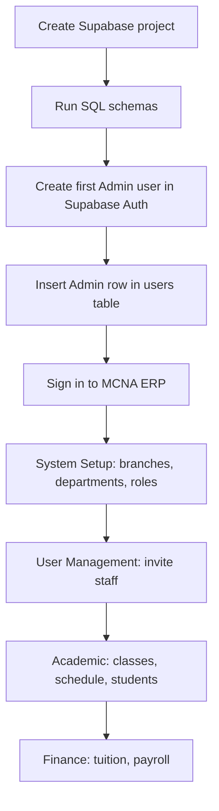
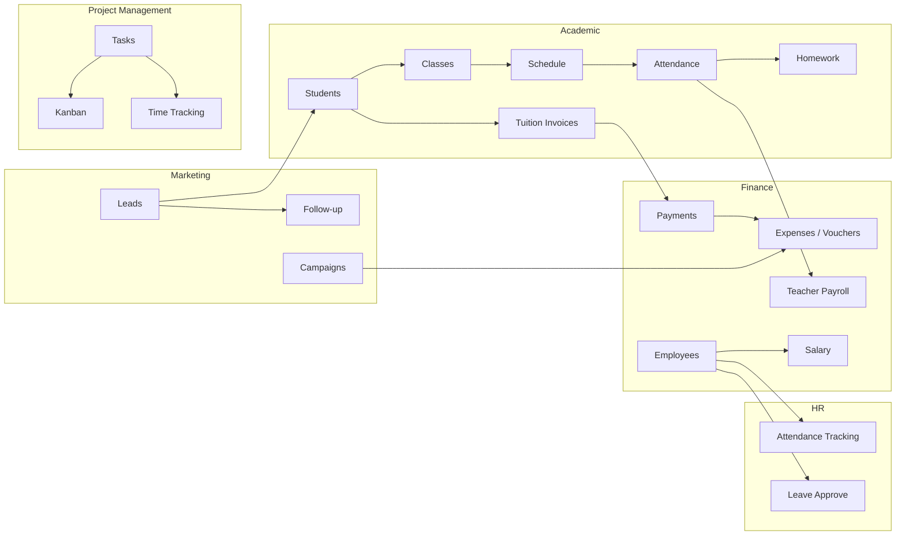

# MCNA ERP — Setup & User Guide

**MCNA ERP** (Scholastic Compass Pro) is a multi-branch academic center management platform. It replaces spreadsheet workflows with a single system for students, classes, schedules, tuition, payroll, HR, marketing, and internal project management.

This guide is written for someone new to the project: how to install it, how the modules connect, and how to use each function.

---

## Table of Contents

1. [Quick Start (Developers)](#1-quick-start-developers)
2. [First-Time Organization Setup](#2-first-time-organization-setup)
3. [Signing In & Daily Use](#3-signing-in--daily-use)
4. [How the System Fits Together](#4-how-the-system-fits-together)
5. [Navigation & Roles](#5-navigation--roles)
6. [Module Reference](#6-module-reference)
   - [6.1 Dashboard](#61-dashboard)
   - [6.2 Academic](#62-academic)
   - [6.3 Finance & Accounting](#63-finance--accounting)
   - [6.4 Human Resources](#64-human-resources)
   - [6.5 Marketing](#65-marketing)
   - [6.6 Project Management](#66-project-management)
   - [6.7 Administration](#67-administration)
7. [Common Workflows](#7-common-workflows)
8. [Role-Based Access Summary](#8-role-based-access-summary)
9. [Notes & Troubleshooting](#9-notes--troubleshooting)

---

## 1. Quick Start (Developers)

### Prerequisites

| Requirement | Version / Notes |
|---|---|
| Node.js | 18+ recommended |
| npm | Comes with Node.js |
| Supabase project | PostgreSQL database + Auth enabled |
| Git | To clone the repository |

### 1.1 Clone and install

```bash
git clone <repository-url>
cd scholastic-compass-pro
npm install
```

### 1.2 Configure environment variables

Create a `.env` file in the project root (copy from an existing `.env` or ask your team for credentials):

```env
VITE_SUPABASE_URL="https://your-project.supabase.co"
VITE_SUPABASE_PUBLISHABLE_KEY="your-anon-key"
```

These values come from **Supabase Dashboard → Project Settings → API**.

> Do not commit `.env` to version control. It contains project secrets.

### 1.3 Set up the database

Run the SQL scripts in your **Supabase SQL Editor** in this order:

| Script | Purpose |
|---|---|
| Core schema tables | Your main Supabase migration / schema (branches, students, classes, users, etc.) |
| `seed-database.sql` | Optional demo data (branches, courses, teachers, students, invoices) |
| `accounting-tables.sql` | Cash vouchers, journal entries, salary receipts |
| `marketing-tables.sql` | Marketing module (leads, campaigns, sources, promotions) |
| `PROJECT_MANAGEMENT_SCHEMA.sql` | Tasks, sprints, time logs, comments |
| `SPRINT_SCHEMA.sql` | Sprint planning tables |

For marketing setup details, see `README_MARKETING_SETUP.md`.

> **Auto-seeding:** On first app load, if the `branches` table is empty, the app automatically seeds demo records. You will see a toast: *"First run: Initializing database with demo records..."*

### 1.4 Run the development server

```bash
npm run dev
```

Open the URL shown in the terminal (commonly `http://localhost:8081` or similar). The dev server port is managed by the TanStack Start / Lovable config.

### 1.5 Other commands

| Command | Purpose |
|---|---|
| `npm run build` | Production build |
| `npm run preview` | Preview production build locally |
| `npm run lint` | Run ESLint |
| `npm run format` | Format code with Prettier |

### 1.6 Production deployment

The app is configured for **Cloudflare Workers** via `wrangler.jsonc`. Build with `npm run build` and deploy using your Cloudflare workflow. Ensure the same `VITE_*` environment variables are set in your deployment environment.

---

## 2. First-Time Organization Setup

Follow this sequence when onboarding a new academic center.



### Step 1 — Create the first Admin account

The login page (`/auth`) only supports **Sign In**. New accounts are created by an Admin via **User Management**, or manually in Supabase:

1. **Supabase Dashboard → Authentication → Users → Add user**
   - Email: e.g. `admin@mcnaedu.vn`
   - Password: choose a secure password (minimum 6 characters)
2. **Supabase Dashboard → Table Editor → `users`**
   - Insert a row with the same `id` as the Auth user UUID
   - Set `role` to `Admin`, `status` to `Active`, and assign a `branch_id`

### Step 2 — Configure the organization (Admin only)

Go to **System Setup** (`/system-setup`):

| Tab | What to configure |
|---|---|
| **Menu Access** | Toggle which sidebar modules each role can see |
| **Departments** | Academic, Finance, HR, Marketing, etc. (supports Excel import) |
| **Roles** | Job roles linked to departments and hierarchy level |
| **Branches** | Physical campus locations (supports Excel import) |

### Step 3 — Invite staff

Go to **User Management** (`/users`) → **Invite User**:

- Creates a Supabase Auth account
- Inserts into `users` and `employee` tables
- Default temporary password: **`password123`** (staff should change it via the avatar menu → **Change Password**)

### Step 4 — Load academic data

1. **Classes** — Create classes with course, teacher, room, branch, and capacity
2. **Schedule** — Add weekly lesson sessions (conflict detection for room/teacher double-booking)
3. **Students** — Enroll students into classes (capacity check enforced)
4. **Tuition** — Invoices are tied to enrolled students

---

## 3. Signing In & Daily Use

**Route:** `/auth`

| Action | How |
|---|---|
| **Sign In** | Enter email and password. Redirects to `/dashboard` on success. |
| **Change Password** | Top-right avatar menu → **Change Password**. Requires current password verification. |
| **Sign Out** | Avatar menu → **Sign Out** |

After sign-in, the app loads the user's profile from the `users` table. The sidebar shows only modules allowed for that role (and enabled in System Setup).

---

## 4. How the System Fits Together

MCNA ERP is organized into six functional areas that share the same database.



### Data flow highlights

| Flow | Path |
|---|---|
| **Student enrollment** | Marketing Lead → Student record → Class enrolment → Tuition invoice |
| **Lesson → teacher pay** | Schedule → Attendance log → Payroll approval → Payslip |
| **Staff salary** | Employee record → Generate payroll → Approve payment → Cash voucher (optional) |
| **Marketing spend** | Campaign budget → Expense voucher (linked source) → Balance Sheet |
| **Internal work** | Task created → Assigned → Kanban/Gantt → Time logged → Done |

---

## 5. Navigation & Roles

The sidebar is grouped into sections defined in `src/lib/nav-config.ts`:

| Section | Modules |
|---|---|
| **Core** | Dashboard |
| **Finance & Accounting** | Tuition, Payments, Expenses, Balance Sheet, Payroll, Salary |
| **Human Resources** | Teachers, Employees, Attendance Tracking, Leave Approve |
| **Academic** | Students, Classes, Schedule, Homework, Attendance, Rooms |
| **Project Management** | Projects, Task Assignment, Kanban, Gantt, Sprint Planning, Workload, Comments, Time Tracking |
| **Marketing** | Leads, Campaigns, Sources, Promotions, Follow-up, Reports |
| **Administration** | User Management, Audit Logs, System Setup |

**Admin** sees all sections. Other roles see a filtered subset. **System Setup** is always visible to Admin even when modules are toggled off.

---

## 6. Module Reference

### 6.1 Dashboard

**Route:** `/dashboard`

The landing page after login. Content depends on the logged-in role.

| Role | View |
|---|---|
| **Admin** | Admin Console + Enterprise Overview (tabbed) |
| **Director** | Executive Overview + Enterprise Overview (tabbed) |
| **Academic Staff / Manager** | Academic Operations dashboard |
| **Accountant / Finance Manager** | Finance Center dashboard |
| **Receptionist** | Reception Desk dashboard |
| **Teacher / Student** | Access-denied message (management roles only) |

**Admin / Director Console** includes: Finance KPIs, People & Operations KPIs, Project Tasks, Revenue Trend chart, Audit Log timeline, Class Health by Branch, Users by Role chart, System Alerts, Tasks by Department, Recent Tasks, Teacher Wages.

**Enterprise Overview** includes: Finance & Accounting stats, Human Resources stats, Project Management progress bars.

**Academic Dashboard** includes: Active Classes, Enrolled Students, Teacher count, Today's Sessions, Class Overview table, Quick Actions.

**Accountant Dashboard** includes: Revenue Collected, Outstanding Debt, Overdue Invoices, Payroll Queue.

**Receptionist Dashboard** includes: Room availability, today's visitors, today's sessions, manual guest check-in.

---

### 6.2 Academic

#### Students

**Route:** `/students`

| Function | Description |
|---|---|
| **Search** | Filter by name or email |
| **Filters** | By class, branch, and status |
| **Add Student** | Name, email, phone, parent name, enrolled class, branch. Capacity check prevents over-enrollment. |
| **Edit Student** | Update profile and class assignment |
| **Delete Student** | Remove student record |
| **Status sorting** | Active students ("Đang học") appear first |
| **Audit log** | Add/update actions are logged automatically |

#### Classes

**Route:** `/classes`

| Function | Description |
|---|---|
| **Class cards** | Show course, teacher, room, branch, enrolment count vs. capacity, status |
| **Create Class** | Name, course, teacher, room, branch, start date, max capacity |
| **Edit / Delete** | Update class details. Delete blocked if active enrolments exist. |
| **Navigate to Schedule** | Quick link from class card |

#### Schedule

**Route:** `/schedule`

| Function | Description |
|---|---|
| **Weekly grid** | Monday–Sunday view with prev/next week navigation |
| **Add Session** | Class, room, teacher, date, start/end time |
| **Conflict detection** | Warns on room or teacher double-booking |
| **Edit / Delete** | Modify or remove scheduled lessons |
| **Audit log** | Schedule changes are logged |

#### Homework

**Route:** `/homework`

| Function | Description |
|---|---|
| **Assignments tab** | Create homework linked to a class (title, description, due date) |
| **Grading Grid** | Staff view: score (0–10) and feedback per submission |
| **Submit Work** | Student view: submit assignments (when Student role is used) |
| **Audit log** | Grading actions are logged |

#### Attendance

**Route:** `/attendance`

| Function | Description |
|---|---|
| **Lesson Sessions** | Select a scheduled lesson log |
| **Student Roster** | Mark each student Present / Late / Absent |
| **Pay summary** | Shows hours, hourly rate, and total pay for the session |
| **Submit Log** | Saves attendance and marks log as Approved (feeds into Payroll) |

#### Rooms

**Route:** `/rooms`

Reuses the **Reception Desk** view:

| Function | Description |
|---|---|
| **Room Availability** | Live free/in-use status based on today's schedule |
| **Search rooms** | Filter by room name |
| **Guest Check-in** | Manual visitor log for front desk |
| **Stats** | Available rooms, today's visitors, sessions today, branch count |

---

### 6.3 Finance & Accounting

#### Tuition Invoices

**Route:** `/tuition`

| Function | Description |
|---|---|
| **Summary Cards** | Total billed, collected, and outstanding |
| **Search** | Filter by student name or invoice ID |
| **Status Badge** | Paid, Partially Paid, Unpaid, or Overdue |
| **Record Payment** | Partial or full payment with method (Bank Transfer, Cash, Card, E-Wallet) |
| **View / Print Invoice** | Printable detail view |
| **Export CSV** | Download filtered invoices |

#### Payments

**Route:** `/accounting/payments`

| Function | Description |
|---|---|
| **Search** | Filter by student name or invoice ID |
| **Payment history** | All individual tuition payment records |
| **Export CSV** | Excel-compatible with Vietnamese characters |

#### Expenses / Cash Vouchers

**Route:** `/accounting/expenses`

| Function | Description |
|---|---|
| **Create Receipt (Phiếu Thu)** | Income voucher with auto voucher number, Vietnamese amount words, debit/credit accounts |
| **Create Payment (Phiếu Chi)** | Expense voucher |
| **Source Linking** | Link to expense, payroll receipt, or marketing campaign |
| **Post Voucher (Duyệt)** | Creates journal entries, updates linked records |
| **Cancel / Edit** | Manage Draft vouchers |
| **View / Print / PDF** | A5 voucher layout with signature blocks |
| **Filter & Export** | By type, department, status, date range |
| **Import Excel** | Bulk-create Draft vouchers with row validation |

#### Balance Sheet

**Route:** `/accounting/balance-sheet`

| Function | Description |
|---|---|
| **Period Selection** | Month, Quarter, or Year |
| **Auto-calculation** | From journal entries, expenses, payroll, marketing |
| **Comparative View** | Current vs. previous period |
| **Balance Check** | Warning if Assets ≠ Sources |
| **Export Excel / Print** | Full report with detail sheets |

#### Payroll (Teachers)

**Route:** `/payroll`

**Payslips tab:**

| Function | Description |
|---|---|
| **Generate Payslip** | Select teacher and month; base from approved attendance logs |
| **Mark as Paid** | Accountant / Admin only |
| **Payslip Table** | All payslips with bonus, deductions, total, status |

**Attendance Logs tab:**

| Function | Description |
|---|---|
| **Pending / Approved summary** | VND totals |
| **Approve Log** | One-click approval for Draft logs |
| **Log table** | Teacher, class, date, hours, rate, total pay, status |

#### Salary (Staff)

**Route:** `/salary` — Finance Manager, Accountant, Admin, Director only

| Function | Description |
|---|---|
| **Period Picker** | Month and year |
| **Generate Payroll** | Creates receipts for all active employees; DB trigger calculates BHXH/BHYT/BHTN (10.5%) and progressive income tax |
| **Summary Bar** | Total fund, voucher channel, receipt count |
| **Approve (Duyệt chi)** | Mark individual receipt as paid |
| **View Payslip** | A4 payslip with letterhead and deduction breakdown |
| **Print / Export PDF** | Download payslip |

---

### 6.4 Human Resources

#### Employees

**Route:** `/employees`

| Function | Description |
|---|---|
| **Search** | By name or phone |
| **Department Filter** | Dropdown filter |
| **Stats Bar** | Total count, filtered count, average salary |
| **Employee Table** | Paginated (15/page): name, role, department, phone, total salary |
| **Detail Modal** | Full profile including contract, base/bonus salary, start date |

#### Teachers

**Route:** `/teachers`

| Function | Description |
|---|---|
| **Teacher Table** | Name, subject, branch, hourly rate (read-only) |

#### Attendance Tracking

**Route:** `/attendance-tracking`

| Function | Description |
|---|---|
| **Date Filter** | Defaults to today |
| **Attendance Table** | Check-in/out, status (PRESENT / LATE / ABSENT / LEAVE), notes |

#### Leave Approve

**Route:** `/leave-approve`

| Function | Description |
|---|---|
| **View Requests** | Own requests for all users; all requests for HR/Director |
| **Filters** | Department and status (Pending / Approved / Rejected) |
| **Add Leave Request** | Employee, reason, start/end dates |
| **Approve / Reject** | HR roles only, with confirmation dialog |

---

### 6.5 Marketing

> Requires `marketing-tables.sql` to be run first. See `README_MARKETING_SETUP.md`.

#### Leads

**Route:** `/marketing/leads`

| Function | Description |
|---|---|
| **Table / Kanban views** | Toggle between list and pipeline board |
| **Search & Filter** | By name, email, phone, status, source |
| **Add / Edit / Delete Lead** | Full name, contact info, source, status, notes, assigned staff |
| **Lead Detail** | Navigate to `/marketing/leads/:id` for activity history and notes |
| **Status pipeline** | New → Interested → Trial Scheduled → Registered → Paid / Lost |
| **Drag on Kanban** | Update lead status by moving cards |

#### Campaigns

**Route:** `/marketing/campaigns`

| Function | Description |
|---|---|
| **Campaign table** | Name, channel, budget, dates, status |
| **Add / Edit / Delete** | Facebook Ads, Google Ads, Workshop, etc. |
| **Status** | Planning, Running, Paused, Completed, Cancelled |
| **Budget tracking** | Links to expense vouchers when posted |

#### Sources

**Route:** `/marketing/sources`

| Function | Description |
|---|---|
| **Source list** | Facebook Ads, Google Ads, Referral, etc. |
| **Add / Edit / Delete** | Name, description, active toggle |

#### Promotions

**Route:** `/marketing/promotions`

| Function | Description |
|---|---|
| **Promotion codes** | Discount type, value, validity dates |
| **Copy code** | One-click copy to clipboard |
| **Status filter** | Active, Scheduled, Expired |

#### Follow-up

**Route:** `/marketing/follow-up`

| Function | Description |
|---|---|
| **Task list** | Follow-up tasks linked to leads |
| **Add / Edit / Delete** | Type, title, note, deadline, priority, assigned staff |
| **Status** | Pending, In Progress, Completed, Overdue |
| **Deadline alerts** | Overdue items highlighted |

#### Reports

**Route:** `/marketing/reports`

| Function | Description |
|---|---|
| **Lead statistics** | Counts by status and source |
| **Conversion metrics** | Lead-to-enrollment funnel |
| **Campaign analysis** | Budget vs. spend overview |
| **Charts** | Visual breakdown of pipeline health |

---

### 6.6 Project Management

#### Task Assignment

**Route:** `/task-assignment`

| Function | Description |
|---|---|
| **Role-based visibility** | Directors: all; Managers: department; Staff: own tasks |
| **Table / Kanban views** | Sortable table or four-column drag-and-drop board |
| **New Task** | Title, description, department, assignee, priority, due date (managers+) |
| **Update Status** | Dropdown or drag-and-drop |
| **Task Detail Modal** | Details, Comments, Attachments, Time tracking tabs |

#### Kanban Board

**Route:** `/kanban-board`

| Function | Description |
|---|---|
| **Four columns** | Todo, In Progress, Review, Done |
| **Drag and Drop** | Update status by moving cards |
| **Assign User** | Inline dropdown on each card |
| **New Task / View Detail** | Create tasks and open detail modal |

#### Gantt Chart

**Route:** `/gantt-chart`

| Function | Description |
|---|---|
| **Zoom** | Week / Month / Quarter |
| **Department filter** | Pill buttons |
| **Today line** | Red vertical marker |
| **Task bars** | Span creation to due date; overdue hatched pattern |
| **Tooltips** | Assignee, dates, status, priority |

#### Sprint Planning

**Route:** `/sprint-planning`

| Function | Description |
|---|---|
| **Sprint list** | Create, select, delete sprints |
| **Capacity tracking** | Hours used vs. team capacity |
| **Add / Remove tasks** | Move tasks between sprint and backlog |
| **Backlog grid** | Unassigned tasks |

#### Workload View

**Route:** `/workload-view`

| Function | Description |
|---|---|
| **User cards** | Capacity %, active/done/overdue counts, progress bar |
| **Overload warning** | Alert at ≥ 90% capacity (8 tasks max) |
| **Task sidebar** | Click a user to see all their tasks |

#### Comments & Threads

**Route:** `/comments-threads`

| Function | Description |
|---|---|
| **Task cards** | Select a task to open its thread |
| **Threaded comments** | Reply, @-mentions, activity log |
| **Real-time updates** | Supabase Realtime subscription |

#### Time Tracking

**Route:** `/time-tracking`

| Function | Description |
|---|---|
| **Quick Start Timer** | One active timer at a time |
| **Manual Entry** | Retroactive time logs |
| **Stats** | Today, this week, all time |
| **Delete Log** | Remove entries with confirmation |

#### Projects

**Route:** `/projects` and `/projects/:projectId`

| Function | Description |
|---|---|
| **Project cards** | Code, name, manager, status, progress |
| **Create / Delete Project** | Full project metadata |
| **Kanban tab** | Per-project four-column board |
| **Calendar / Workload / Analytics tabs** | Placeholders for future features |

---

### 6.7 Administration

#### User Management

**Route:** `/users` — Admin only

| Function | Description |
|---|---|
| **User Table** | Paginated list with role, branch, status |
| **Role Switcher** | Change role inline (logged in Audit) |
| **Active Toggle** | Activate or block accounts |
| **Delete User** | Permanent removal |
| **Invite User** | Creates Auth + `users` + `employee` records. Default password: `password123` |
| **Import Excel** | Bulk user onboarding |
| **Bonus Salary Validation** | Must be < 70% of base salary |

#### Audit Logs

**Route:** `/audit` — Admin only

| Function | Description |
|---|---|
| **Timeline View** | Chronological log with actor, action, target, type, timestamp |
| **Auto-logged Events** | Attendance, classes, payroll, roles, users, students, homework, schedule, tuition |

#### System Setup

**Route:** `/system-setup` — Admin only (always visible in sidebar)

| Tab | Functions |
|---|---|
| **Menu Access** | Per-module, per-role toggle matrix. Save to `module_access` table. |
| **Departments** | Add, rename, delete, import Excel (`department_name` column) |
| **Roles** | Add, rename, delete roles with department and hierarchy level |
| **Branches** | Add, rename, delete branches; import Excel (`branch_name` column) |

---

## 7. Common Workflows

### Workflow A — Enroll a new student (end to end)

1. **Marketing** (optional): Create a lead → follow up → mark as Registered
2. **Students**: Add student, select class and branch (capacity enforced)
3. **Tuition**: Invoice appears; record first payment
4. **Schedule**: Student's class sessions are already on the weekly grid
5. **Homework / Attendance**: Teacher marks attendance and grades homework

### Workflow B — Pay a teacher

1. **Schedule**: Lessons are scheduled for the class
2. **Attendance**: Teacher submits lesson log with student attendance
3. **Payroll → Attendance Logs**: Accountant approves the log
4. **Payroll → Payslips**: Generate payslip for the month
5. **Payroll**: Mark payslip as Paid

### Workflow C — Run monthly staff salary

1. **Employees**: Ensure all staff have salary and contract data
2. **Salary**: Select period → **Generate Payroll**
3. Review gross, insurance (10.5%), tax, and net per employee
4. **Approve (Duyệt chi)** each receipt
5. (Optional) **Expenses**: Create a Phiếu Chi voucher linked to payroll

### Workflow D — Close the books for a period

1. **Expenses**: Post all Draft vouchers (Thu/Chi)
2. **Tuition**: Ensure payments are recorded
3. **Balance Sheet**: Select period, verify Assets = Sources
4. **Export Excel** for archival

### Workflow E — Onboard a new staff member

1. **System Setup**: Confirm department and role exist
2. **User Management → Invite User**: Fill profile, role, branch, salary
3. Staff signs in with `password123`, changes password
4. Staff sees only modules enabled for their role in System Setup

---

## 8. Role-Based Access Summary

| Role | Key Accessible Sections |
|---|---|
| **Admin** | All sections + User Management + Audit Logs + System Setup |
| **Director** | All sections (read-all across departments) |
| **Finance Manager** | Tuition, Payments, Expenses, Balance Sheet, Salary, Task Management |
| **Accountant** | Tuition, Payments, Payroll (approve), Task Management |
| **Academic Manager** | Classes, Students, Schedule, Homework, Attendance, Rooms, Task Management (Academic) |
| **Academic Staff** | Classes, Students, Schedule, Homework, Attendance, Rooms, Payroll (view), Task Management |
| **HR Manager** | Employees, Teachers, Attendance Tracking, Leave Approve, Task Management (HR) |
| **HR Staff** | Employees, Teachers, Attendance Tracking, Leave Approve, Task Management |
| **Marketing Manager** | Full Marketing module, Task Management (Marketing) |
| **Marketing Staff** | Full Marketing module, Task Management |

> System Setup can further restrict modules per role beyond this table.

---

## 9. Notes & Troubleshooting

### General

| Topic | Detail |
|---|---|
| **Currency** | Vietnamese Dong (VND), `vi-VN` locale |
| **Language** | English UI with Vietnamese labels in Finance/Salary/HR |
| **Database** | Supabase PostgreSQL with Realtime (Comments & Threads) |
| **Default invite password** | `password123` — change on first login |

### Common issues

| Problem | Solution |
|---|---|
| Blank data on first load | Wait for auto-seed toast to finish, or run `seed-database.sql` manually |
| Marketing pages empty | Run `marketing-tables.sql` in Supabase SQL Editor |
| "Supabase env variables are missing" | Check `.env` has `VITE_SUPABASE_URL` and `VITE_SUPABASE_PUBLISHABLE_KEY` |
| Cannot sign in | Verify user exists in both Supabase Auth and `users` table with matching UUID |
| Invite fails ("email already registered") | User already exists in Auth; delete or use a different email |
| Sidebar module missing | Admin: check **System Setup → Menu Access** for that role |
| Balance Sheet imbalance | Ensure all vouchers are Posted; check for unlinked journal entries |

### SQL reference files

| File | Contents |
|---|---|
| `seed-database.sql` | Demo academic data |
| `accounting-tables.sql` | Finance / voucher schema |
| `marketing-tables.sql` | Marketing schema + sample data |
| `PROJECT_MANAGEMENT_SCHEMA.sql` | Tasks, projects, time logs |
| `SPRINT_SCHEMA.sql` | Sprint tables |
| `SUPABASE_COMMANDS.sql` | Marketing commands (alternate) |
| `README_MARKETING_SETUP.md` | Marketing setup walkthrough |

---

*MCNA ERP — Built for multi-branch academic centers. For technical contributions, follow existing patterns in `src/lib/nav-config.ts`, `src/hooks/use-database.tsx`, and route files under `src/routes/_app/`.*
